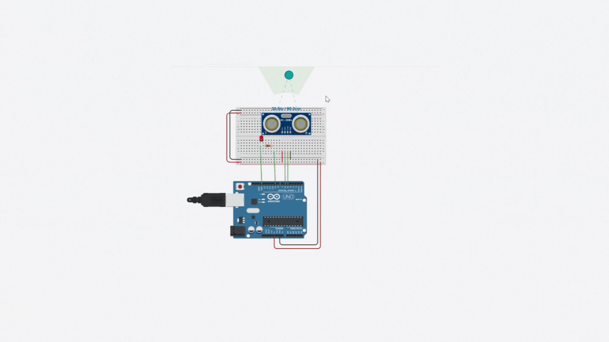

# ElectronicsEngineering-Task3-discover-person-in-front-of-sensor
<h4>In this task, I designed a circuit that discover if a person in front of sensor or not .</h4> 

<h3>if person spend 3 second in front of sensor, the led will trun on </h3> 

<h3>if no person  in front of sensor, the led will trun off </h3> 
 
